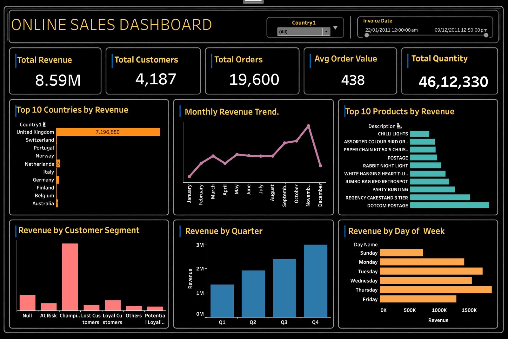

# 🛒 E-Commerce Customer Intelligence & Sales Analytics

<p align="center">
  
</p>

<p align="center">
  <b>End-to-end retail analytics using Python, Pandas, RFM customer segmentation and Tableau.</b>
</p>

<p align="center">
  <a href="https://public.tableau.com/app/profile/snehasish.das4354/viz/OnlineRetailSalesDashboard_17869560125930/OnlineRetailSalesDashboard">Interactive Tableau Dashboard</a> •
  <a href="https://github.com/Unknowncoder3/E-Commerce-Customer-Intelligence-Sales-Analytics">Repository</a>
</p>

---

## 📌 Overview

This project transforms raw online-retail transactions into **business-ready customer and sales intelligence**.

The workflow covers data cleaning, exploratory analysis, feature engineering, RFM segmentation, sales analysis and interactive Tableau reporting. The objective is to answer practical business questions around revenue, customers, products, geography and seasonality.

### Business questions

- Which countries and products drive the most revenue?
- How does revenue change over time?
- Who are the highest-value customers?
- Which customer groups are at risk of churn?
- Which periods and weekdays perform best?
- How can customer segmentation support retention decisions?

---

## 🎯 What This Project Demonstrates

| Area | Demonstrated skills |
|---|---|
| Data preparation | Missing values, invalid transactions, duplicates, dates |
| Exploratory analysis | Revenue, orders, customers, products, geography, trends |
| Customer analytics | RFM scoring and behavioral segmentation |
| Visualization | Tableau dashboards and KPI design |
| Business intelligence | Translating analytical findings into business questions |
| Reproducibility | Notebook-based Python workflow and documented structure |

---

## 🧰 Tech Stack

- **Python** — analysis and preprocessing
- **Pandas / NumPy** — data manipulation
- **Jupyter Notebook** — reproducible analysis
- **Tableau** — interactive dashboarding
- **Excel** — source transaction data
- **RFM Analysis** — customer segmentation
- **Git & GitHub** — version control

---

## 🔄 End-to-End Workflow

```text
Raw Online Retail Transactions
            ↓
Data Quality Checks & Cleaning
            ↓
Feature Engineering
            ↓
Exploratory Data Analysis
            ↓
RFM Customer Analysis
            ↓
Customer Segmentation
            ↓
Sales & Product Analysis
            ↓
Tableau Dashboard
            ↓
Business Insights & Recommendations
```

---

## 🧹 Data Preparation

The source transaction data contains fields such as invoice number, invoice date, customer ID, country, product description, quantity and unit price.

The analysis pipeline includes:

- Handling missing customer information
- Removing invalid transactions
- Handling cancelled/returned invoices
- Checking duplicate records
- Converting dates to analysis-ready formats
- Creating revenue measures from quantity and unit price
- Preparing analytical datasets for segmentation and visualization

---

## 📊 Core KPIs

The current dashboard reports approximately:

- **Revenue:** 9.75M
- **Orders:** 22,061
- **Customers:** 4,372
- **Average Order Value:** 442

These figures depend on the dashboard's filters and analysis definitions.

---

## 👥 RFM Customer Segmentation

RFM analysis evaluates customers using three dimensions:

- **Recency:** how recently a customer purchased
- **Frequency:** how often a customer purchased
- **Monetary:** how much revenue a customer generated

The resulting scores are used to create behavioral groups such as:

- Champions
- Loyal Customers
- Potential Loyalists
- At Risk
- Lost Customers
- Other segments

This provides a practical framework for prioritizing retention and customer engagement strategies.

---

## 📈 Sales & Customer Analysis

The project analyzes:

- Revenue by country
- Monthly revenue trends
- Quarterly performance
- Revenue by weekday
- Top products by revenue
- Customer-segment contribution
- Customer purchasing behavior

The Tableau dashboard combines these views into an interactive business-facing report.

---

## 📊 Tableau Dashboard

### Dashboard capabilities

- KPI cards
- Country filtering
- Date filtering
- Revenue and order analysis
- Customer analysis
- Top countries
- Monthly trends
- Top products
- Customer segments
- Quarterly analysis
- Day-of-week analysis

### 🔗 Interactive dashboard

**[Open the Tableau Public Dashboard →](https://public.tableau.com/app/profile/snehasish.das4354/viz/OnlineRetailSalesDashboard_17869560125930/OnlineRetailSalesDashboard)**

### Preview

<p align="center">
  
</p>

---

## 💡 Business Insights

The analysis highlights several decision-support themes:

1. Revenue is concentrated in a limited number of geographic markets.
2. RFM segmentation separates high-value customers from customers showing weaker engagement.
3. Revenue varies across months and quarters, revealing seasonal patterns.
4. A smaller group of products contributes a meaningful share of sales.
5. Customer-level analysis can support more targeted retention strategies.

> The purpose of these findings is to demonstrate how transaction data can be translated into actionable business questions and decisions.

---

## 📂 Repository Structure

```text
E-Commerce-Customer-Intelligence-Sales-Analytics/
├── Datasets/
│   ├── Online Retail.xlsx
│   ├── rfm_customer_segmentation.csv
│   └── rfm_customer_segmentation_tableau.csv
├── notebook/
│   └── 01_data_cleaning.ipynb
├── Screenshots/
│   └── Dashboard.jpeg
├── Tableau/
│   └── Online Retail Sales Dashboard.twbx
├── .gitignore
└── Readme.md
```

---

## 🚀 Reproduce the Python Analysis

```bash
git clone https://github.com/Unknowncoder3/E-Commerce-Customer-Intelligence-Sales-Analytics.git
cd E-Commerce-Customer-Intelligence-Sales-Analytics
python -m venv .venv
```

Activate the environment and install the analysis dependencies:

```bash
pip install pandas numpy matplotlib seaborn openpyxl jupyter
```

Then run:

```bash
jupyter notebook
```

Open `notebook/01_data_cleaning.ipynb` and execute the workflow sequentially.

To explore the Tableau workbook, open the `.twbx` file in Tableau Desktop.

---

## 🔮 Future Improvements

- [ ] Add SQL-based analysis layer
- [ ] Add customer lifetime value
- [ ] Add cohort and retention analysis
- [ ] Add product profitability analysis
- [ ] Add sales forecasting
- [ ] Automate dashboard refresh
- [ ] Build a lightweight analytics web application

---

## 👨‍💻 Author

**Snehasish Das** — Data Analyst | Applied AI Developer

- GitHub: https://github.com/Unknowncoder3
- Tableau Public: https://public.tableau.com/app/profile/snehasish.das4354
- LinkedIn: https://www.linkedin.com/in/snehasish-das-b75a551b0/

---

⭐ If this project is useful, consider starring the repository.
